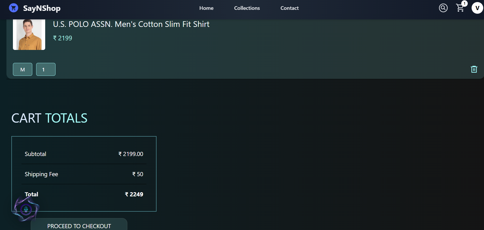

# 🛒SayNShop

SayNShop is a complete e-commerce web application built with the MERN stack (MongoDB, Express, React, Node.js). It offers admin panel for product and order management,
along with a user-friendly shopping experience for customers. The application also includes an innovative voice command navigation feature powered by native browser APIs.

## Features

### User

- Sign up and log in using secure authentication
- Browse home page with curated items
- View collections filtered by Men, Women, and Kids
- Add and manage items in the cart
- Place orders and view order history
- Track order status in real-time
- Search for products by name or category
- **Voice Command Navigation** using native browser APIs

### Admin

- Add new products (with image upload support)
- View and manage product listings
- View and update customer orders
- Change order status: Packaged, Shipped, Delivered

## Tech Stack

**Frontend:** React, Context API, React Router, Tailwind CSS, Axios, Web Speech API (SpeechRecognition, SpeechSynthesis)  
**Backend:** Node.js, Express, MongoDB, Mongoose, JWT, bcrypt, Multer, Cloudinary

---

#  Voice Command Navigator for React

A lightweight voice command assistant for React web app using native browser APIs:  
**`SpeechRecognition`** (voice-to-text) and **`SpeechSynthesis`** (text-to-voice).

##  How It Works

### `SpeechRecognition` (Voice to Text)

- Listens to user **spoken voice** using the microphone.
- Converts what user say into **text** (called a *transcript*).
- App matches that transcript to perform specific actions (like navigate to `/cart` or show the search bar).

### `SpeechSynthesis` (Text to Voice)

- Converts **text into speech**, giving **audio feedback** like:
  - “Opening cart”
  - “Search closed”
  - “Try again”

This creates a natural voice assistant experience inside web app.

##  Features

-  Voice-controlled navigation
-  Spoken feedback for every action
-  Smooth animation on mic activation
-  Toast notifications on unknown commands
- Sound effect (`open.mp3`) when starting voice recognition

---

##  Commands Supported

| Voice Command                     | Action                            |
|----------------------------------|-----------------------------------|
| "open search"                    | Show search bar                   |
| "close search"                   | Hide search bar                   |
| "go to home" / "homepage"        | Navigate to Home                  |
| "go to cart" / "cart"            | Navigate to Cart                  |
| "open collection" / "products"   | Navigate to Product Collection    |
| "contact"                        | Navigate to Contact page          |
| "my orders" / "show my orders"   | Navigate to Orders page           |

> ℹ️ If no command matches, a message says "Try Again"

---

## Technologies Used

- **Web APIs**:
  - [`SpeechRecognition`](https://developer.mozilla.org/en-US/docs/Web/API/SpeechRecognition)
  - [`SpeechSynthesis`](https://developer.mozilla.org/en-US/docs/Web/API/SpeechSynthesis)

---

## Screenshots

#### Login Page

#### Home Page

#### Collections Page

#### Single Product View

#### Cart Page

### Using Voice

### Admin Panel

#### Add Product

---

